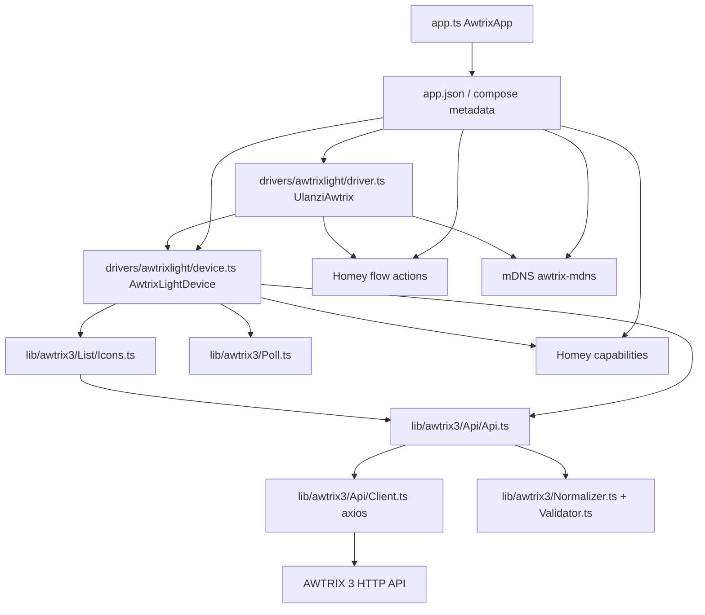

# Analýza existujícího AWTRIX 3 driveru

Tento dokument popisuje aktuální implementaci AWTRIX 3 driveru v repozitáři po strukturálním oddělení knihovního kódu do `lib/awtrix3`.

Aktualizace architektonického rozhodnutí: AWTRIX 3 a AWTRIX NG se mají brát jako dvě rozdílné implementace. Kód AWTRIX 3 je oddělený pod `lib/awtrix3`, budoucí kód AWTRIX NG patří pod `lib/awtrixng`. Nemá vznikat sdílená runtime vrstva typu `lib/awtrix/common`, protože by snadno zakrývala rozdíly mezi protokoly.

## Relevantní soubory

### Zdrojový kód driveru a HTTP vrstvy

| Soubor | Role |
|---|---|
| `drivers/awtrixlight/driver.ts` | Homey driver `UlanziAwtrix`; inicializuje flow karty a pairing přes mDNS discovery. |
| `drivers/awtrixlight/device.ts` | Homey device `AwtrixLightDevice`; drží instanci API klienta, polling, lifecycle hooky, capabilities a příkazové metody `cmd*`. |
| `drivers/awtrixlight/interfaces.ts` | Úzké pomocné interface pro fail/poll integraci (`DeviceFailer`, `DevicePoll`). Nejde o společné aplikační rozhraní driveru. |
| `lib/awtrix3/Api/Api.ts` | AWTRIX 3 API wrapper; mapuje doménové metody na HTTP endpointy a zpracovává status do dostupnosti Homey zařízení. |
| `lib/awtrix3/Api/Client.ts` | Nízká HTTP vrstva nad `axios`; skládá URL, hlavičky, Basic Auth, timeouty a mapuje HTTP status kódy. |
| `lib/awtrix3/Api/Response.ts` | Interní enum `Status` a interface `Response`. |
| `lib/awtrix3/Types.ts` | Typy payloadů a očekávaných odpovědí (`AwtrixStats`, `SettingOptions`, `NotifyOptions`, `AppOptions`, atd.). |
| `lib/awtrix3/Normalizer.ts` | Validace/normalizace request payloadů před odesláním na AWTRIX 3. |
| `lib/awtrix3/Validator.ts` | Pomocné validátory pro barvy, čísla, efekty, overlay, fragmenty textu atd. |
| `lib/awtrix3/Poll.ts` | AWTRIX 3 polling utilita používaná zařízením. |
| `lib/awtrix3/List/Icons.ts` | Načítá seznam ikon z AWTRIX filesystem endpointu a poskytuje autocomplete pro flow karty. |
| `lib/awtrix3/List/Apps.ts` | Neimplementovaný skeleton pro práci s appkami; importuje konkrétní `AwtrixLightDevice`. |
| `app.ts` | Homey app class; pouze loguje inicializaci, driver nevytváří přímo. |

### Homey compose / registrace / metadata

| Soubor | Role |
|---|---|
| `drivers/awtrixlight/driver.compose.json` | Definuje driver `awtrixlight`: capabilities, discovery, pair flow, obrázky, konektivitu. |
| `drivers/awtrixlight/driver.settings.compose.json` | Nastavení zařízení: login (`user`, `pass`) a vybraná AWTRIX settings pole. |
| `.homeycompose/discovery/awtrix-mdns.json` | mDNS discovery strategie pro AWTRIX 3. |
| `.homeycompose/capabilities/*.json` | Vlastní capabilities `awtrix_matrix`, `button_next`, `button_prev`, `ip`, `rssi`. |
| `.homeycompose/flow/actions/*.json` | Definice flow akcí navázaných na `driver_id=awtrixlight`. |
| `.homeycompose/app.json` | Compose zdroj app metadata. |
| `app.json` | Vygenerovaný manifest; obsahuje finální driver záznam `id: "awtrixlight"`, flow karty, capabilities a discovery. |

### Testy a dokumentace

| Soubor | Role |
|---|---|
| `test/core.test.js` | Jediné testy; pokrývají normalizaci, mapování HTTP statusů a `Poll`. |
| `package.json` | `npm test` spouští `npm run build && node --test test/*.test.js`. |
| `docs/vendor/awtrix3-http-api.md` | Vendorizovaná dokumentace AWTRIX 3 HTTP API. |
| `docs/vendor/awtrixng-http-api.md` | Vendorizovaná dokumentace AWTRIX NG HTTP API; zatím není použita existujícím driverem. |

## 1. Společné rozhraní driveru

V repozitáři není definované samostatné společné rozhraní typu `AwtrixDriver`, `DisplayDriver` nebo `DeviceDriver`, které by abstraktně popisovalo schopnosti zařízení bez vazby na AWTRIX 3.

Aktuální „rozhraní“ je implicitní a skládá se z několika vrstev:

1. **Homey SDK rozhraní**
   - `drivers/awtrixlight/driver.ts` dědí z `homey.Driver`.
   - `drivers/awtrixlight/device.ts` dědí z `homey.Device`.
   - Homey lifecycle hooky (`onInit`, `onPair`, `onAdded`, `onSettings`, `onDeleted`, `onDiscovery*`) jsou faktické integrační body.

2. **Konkrétní device command facade**
   - `AwtrixLightDevice` vystavuje veřejné metody `cmdNotify`, `cmdPower`, `cmdIndicator`, atd.
   - `driver.ts` na nich přímo závisí přes typ `AwtrixLightDevice`.

3. **HTTP API wrapper**
   - `lib/awtrix3/Api/Api.ts` vystavuje metody jako `notify`, `customApp`, `getStats`, `setSettings`.
   - Je to konkrétní wrapper pro AWTRIX 3 endpointy, ne obecný driver interface.

4. **Pomocné interface v `drivers/awtrixlight/interfaces.ts`**
   - `DeviceFailer` a `DevicePoll` pouze popisují metody/stav potřebný třídou `Api` pro availability handling.
   - Neobsahují funkční schopnosti zařízení a nejsou použitelné jako společné rozhraní pro AWTRIX 3/NG.

Důsledek: AWTRIX NG nemá být připojen přes společnou abstrakci předstírající kompatibilitu. Má vzniknout samostatná implementace s vlastním kódem pod `lib/awtrixng` a s explicitním zacházením s nekompatibilitami.

## 2. Soubory tvořící AWTRIX 3 driver

Kompletní implementace AWTRIX 3 driveru je rozprostřená přes:

- `drivers/awtrixlight/driver.ts`
- `drivers/awtrixlight/device.ts`
- `drivers/awtrixlight/interfaces.ts`
- `drivers/awtrixlight/driver.compose.json`
- `drivers/awtrixlight/driver.settings.compose.json`
- `drivers/awtrixlight/assets/**`
- `lib/awtrix3/Api/Api.ts`
- `lib/awtrix3/Api/Client.ts`
- `lib/awtrix3/Api/Response.ts`
- `lib/awtrix3/Types.ts`
- `lib/awtrix3/Normalizer.ts`
- `lib/awtrix3/Validator.ts`
- `lib/awtrix3/Poll.ts`
- `lib/awtrix3/List/Icons.ts`
- částečně `lib/awtrix3/List/Apps.ts` (neimplementováno, ale typově svázané s AWTRIX 3 device třídou)
- `.homeycompose/discovery/awtrix-mdns.json`
- `.homeycompose/capabilities/*.json`
- `.homeycompose/flow/actions/*.json`
- vygenerovaný `app.json`

## 3. Jak se driver vytváří a registruje

### Registrace v Homey manifestu

Driver je registrován jako Homey driver s ID `awtrixlight`:

- zdroj: `drivers/awtrixlight/driver.compose.json`
- vygenerovaný výstup: `app.json`, záznam v `drivers[]`, `id: "awtrixlight"`

Driver metadata:

- název: `Awtrix3`
- class: `other`
- platforms: `local`
- connectivity: `lan`
- discovery: `awtrix-mdns`
- capabilities:
  - `measure_battery`
  - `measure_humidity`
  - `measure_luminance`
  - `measure_temperature`
  - `button_prev`
  - `button_next`
  - `alarm_generic.indicator1`
  - `alarm_generic.indicator2`
  - `alarm_generic.indicator3`
  - `awtrix_matrix`
  - `rssi`
  - `ip`
  - `button.rediscover`

### Načtení tříd

Homey podle konvence načítá:

- `drivers/awtrixlight/driver.ts`, který exportuje `UlanziAwtrix` (`module.exports = UlanziAwtrix`)
- `drivers/awtrixlight/device.ts`, který exportuje `AwtrixLightDevice` (`module.exports = AwtrixLightDevice`)

`app.ts` samotný driver nevytváří; pouze definuje `AwtrixApp` a loguje inicializaci aplikace.

### Vytvoření zařízení při párování

`UlanziAwtrix.onPair()`:

1. získá discovery strategy přes `this.getDiscoveryStrategy()`;
2. získá aktuální discovery výsledky přes `getDiscoveryResults()`;
3. pro `list_devices` vrátí každé nalezené zařízení jako:

```json
{
  "name": "<discoveryResult.id>",
  "data": {
    "id": "<discoveryResult.id>"
  },
  "store": {
    "address": "<discoveryResult.address>"
  },
  "settings": {
    "user": null,
    "pass": null
  }
}
```

Ruční přidání je v kódu vypnuté konstantou `ManualAdd = false`.

### Inicializace device instance

`AwtrixLightDevice.onInit()`:

1. nastaví zařízení do `unavailable` se stavem `loading`;
2. spustí migraci capabilities;
3. registruje capability listenery;
4. vytvoří HTTP API:

```ts
this.api = new Api(
  new ApiClient({ ip: this.getStoreValue('address') }),
  this,
);
```

5. vytvoří službu ikon `new Icons(this.api, this)`;
6. vytvoří `Poll` s intervalem 60 s a prodlouženým intervalem 300 s;
7. spustí `initializeDevice()`.

## 4. Veřejné metody driveru a device facade

### `drivers/awtrixlight/driver.ts` (`UlanziAwtrix`)

| Metoda | Volá ji | Účel | Poznámka |
|---|---|---|---|
| `onInit(): Promise<void>` | Homey runtime | Inicializace driveru, získání lokální IP Homey a registrace flow karet. | `homeyIp` se dále v aktuálním kódu nepoužívá. |
| `initFlows(): Promise<void>` | `onInit()` | Registruje run listenery a autocomplete listenery flow akcí. | Přímo typuje argument `device` jako `AwtrixLightDevice`. |
| `onPair(session: PairSession)` | Homey pairing | Vrací mDNS nalezená zařízení pro párovací UI. | Ruční add je vypnutý. |

### `drivers/awtrixlight/device.ts` (`AwtrixLightDevice`)

| Metoda | Použití z aplikace | AWTRIX/API akce | Návrat |
|---|---|---|---|
| `onInit()` | Homey lifecycle | Inicializuje API klienta, polling, capabilities a stav zařízení. | `Promise<void>` implicitně |
| `initializeDevice()` | `onInit()` | Nastaví credentials, ověří `/api/stats`, refreshne stav/settings/effects. | `Promise<void>` |
| `onAdded()` | Homey lifecycle | Po přidání pošle notifikaci `HOMEY`, nastaví IP capability a nahraje bundled ikony. | `Promise<void>` |
| `onSettings(...)` | Homey lifecycle | Ověří nové credentials, pošle `/api/settings`, případně `/api/reboot`. | `Promise<string | void>` |
| `onDeleted()` | Homey lifecycle | Zastaví polling. | `Promise<void>` |
| `onDiscoveryResult(discoveryResult)` | Homey discovery | Páruje discovery výsledek podle `discoveryResult.id === this.getData().id`. | `boolean` |
| `onDiscoveryAvailable(discoveryResult)` | Homey discovery / rediscover | Reaguje na změnu IP adresy. | `Promise<boolean>` |
| `onDiscoveryAddressChanged(discoveryResult)` | `onDiscoveryAvailable()` | Aktualizuje IP v API klientu, store a capability; ověří zařízení. | `Promise<boolean>` |
| `tryRediscover()` | polling / button.rediscover / init | Zkusí najít aktuální mDNS výsledek pro `data.id`. | `Promise<boolean>` |
| `refreshAll()` | init | Spustí refresh capabilities, settings a effects. | `void` |
| `refreshCapabilities()` | polling / init | GET `/api/stats`, mapování na Homey capabilities. | `Promise<void>` |
| `refreshSettings()` | init | GET `/api/settings`, mapování vybraných settings do Homey. | `Promise<void>` |
| `refreshEffects()` | init | GET `/api/effects`, uložení do store `effects`. | `Promise<void>` |
| `connected()` | `onAdded()` / init | Pošle notifikaci `HOMEY`. | `void` |
| `initFlows()` | `onInit()` | Registruje capability listenery `awtrix_matrix`, `button_next`, `button_prev`. | `void` |
| `testDevice(user?, pass?)` | init/settings/rediscovery | Ověří dostupnost přes `/api/stats`. | `Promise<boolean>` |
| `migrate()` | `onInit()` | Upravuje pořadí a přítomnost capabilities. | `Promise<void>` |
| `cmdNotify(msg, params)` | flow driver, `connected()` | POST `/api/notify`. | `Promise<void>` |
| `cmdCustomApp(name, params)` | flow `customApp` | POST `/api/custom?name=homey:<name>`. | `Promise<void>` |
| `cmdRemoveCustomApp(name)` | flow `removeCustomApp` | POST `/api/custom?name=homey:<name>` s prázdným JSON objektem. | `Promise<void>` |
| `cmdDismiss()` | flow `notificationDismiss` | POST `/api/notify/dismiss`. | `Promise<void>` |
| `cmdRtttl(melody)` | flow `playRTTTL` | POST `/api/rtttl`. | `Promise<void>` |
| `cmdPower(power)` | capability / flow `displaySet` | POST `/api/power`. | `Promise<void>` |
| `cmdIndicator(id, options)` | flow `indicator`, `indicatorDismiss` | POST `/api/indicator1..3`. | `Promise<void>` |
| `cmdAppNext()` | capability `button_next` | POST `/api/nextapp`. | `Promise<void>` |
| `cmdAppPrev()` | capability `button_prev` | POST `/api/previousapp`. | `Promise<void>` |
| `cmdReboot()` | nepřímo dostupné, nevolané flow | POST `/api/reboot`. | `Promise<void>` |
| `cmdSetSettings(options)` | nepoužito mimo třídu | POST `/api/settings`. | `Promise<void>` |
| `cmdGetSettings()` | refresh | GET `/api/settings`. | `Promise<SettingOptions | null>` |
| `cmdGetStats()` | refresh | GET `/api/stats`. | `Promise<AwtrixStats | null>` |
| `cmdGetEffects()` | refresh | GET `/api/effects`. | `Promise<string[] | null>` |
| `cmdGetImages()` | ikony/autocomplete | GET `/list?dir=/ICONS/`. | `Promise<AwtrixImage[] | null>` |
| `setCapabilityValues(values)` | `refreshCapabilities()` | Batch wrapper nad `setCapabilityValue`. | `Promise<void>` |
| `failsReset()` | `Api.processResponseCode()` | Reset počítadla selhání. | `void` |
| `failsAdd()` | `Api.processUnavailability()` | Inkrementace selhání. | `void` |
| `failsExceeded()` | `Api.processUnavailability()` | Vyhodnocení prahu selhání. | `boolean` |
| `failsCritical(value)` | init | Dočasné přepnutí okamžitého failování. | `void` |

### `lib/awtrix3/Api/Api.ts` veřejné metody

`Api` je také veřejná TypeScript class, ale zbytek aplikace ji používá hlavně přes `AwtrixLightDevice.cmd*`. Metody odpovídají AWTRIX 3 endpointům:

| Metoda | Endpoint | Účel |
|---|---|---|
| `setCredentials(user, pass)` | — | Nastaví Basic Auth údaje v klientu. |
| `setIp(ip)` | — | Změní IP adresu v klientu. |
| `setDebug(debug)` | — | Zapne/vypne debug log HTTP vrstvy. |
| `isAvaible()` | GET `/api/stats` | Ověří dostupnost. Název je překlep (`Avaible`). |
| `dismiss()` | POST `/api/notify/dismiss` | Zavře sticky notifikaci. |
| `rtttl(melody)` | POST `/api/rtttl` | Přehraje RTTTL melodii. |
| `power(power)` | POST `/api/power` | Zapne/vypne matrix. |
| `indicator(id, options)` | POST `/api/indicator1..3` | Nastaví indikátor. |
| `appNext()` | POST `/api/nextapp` | Další appka. |
| `appPrev()` | POST `/api/previousapp` | Předchozí appka. |
| `reboot()` | POST `/api/reboot` | Restart zařízení. |
| `notify(msg, options)` | POST `/api/notify` | Notifikace. |
| `customApp(name, options)` | POST `/api/custom?name=homey:<name>` | Vytvoření/aktualizace custom app. |
| `removeCustomApp(name)` | POST `/api/custom?name=homey:<name>` | Odstranění custom app prázdným payloadem `{}`. |
| `setSettings(options)` | POST `/api/settings` | Změna settings. |
| `getSettings()` | GET `/api/settings` | Načtení settings. |
| `getStats()` | GET `/api/stats` | Načtení statistik/stavu. |
| `getEffects()` | GET `/api/effects` | Načtení seznamu efektů. |
| `uploadImage(data, name)` | POST `/edit` | Upload souboru do `/ICONS/<name>`. |
| `getImages()` | GET `/list?dir=/ICONS/` | Seznam souborů ikon. |
| `clientGet`, `clientGetDirect`, `clientPost`, `clientUpload`, `clientVerify` | interní helpery | Společná síťová vrstva. |

## 5. Používané AWTRIX 3 HTTP endpointy

`Client.get()` a `Client.post()` vždy prefixují endpoint `http://<ip>/api/`. `Client.getDirect()` a `Client.upload()` používají přímou cestu bez `/api/`.

| Kódová metoda | HTTP metoda | URL | Request payload podle kódu | Response očekávaná kódem | Použití |
|---|---:|---|---|---|---|
| `Api.clientVerify()` / `getStats()` | GET | `/api/stats` | žádný | JSON `AwtrixStats`; při ověření stačí status `Ok` | detekce dostupnosti, polling capabilities |
| `Api.getEffects()` | GET | `/api/effects` | žádný | `string[]` | validace `effect` u notify/custom app |
| `Api.getSettings()` | GET | `/api/settings` | žádný | `SettingOptions` subset | synchronizace Homey settings |
| `Api.setSettings()` | POST | `/api/settings` | JSON z `settingOptions()` | jen HTTP status | změna settings z Homey UI |
| `Api.power()` | POST | `/api/power` | `{ "power": boolean }` | jen HTTP status | capability `awtrix_matrix`, flow `displaySet` |
| `Api.notify()` | POST | `/api/notify` | JSON z `notifyOptions({ text: msg, ...options })` | jen HTTP status | notification flows, `connected()` |
| `Api.dismiss()` | POST | `/api/notify/dismiss` | žádný / `undefined` | jen HTTP status | flow `notificationDismiss` |
| `Api.rtttl()` | POST | `/api/rtttl` | string melodie | jen HTTP status | flow `playRTTTL` |
| `Api.indicator()` | POST | `/api/indicator1`, `/api/indicator2`, `/api/indicator3` | JSON z `indicatorOptions()` | jen HTTP status | flow `indicator`, `indicatorDismiss` |
| `Api.appNext()` | POST | `/api/nextapp` | žádný / `undefined` | jen HTTP status | capability `button_next` |
| `Api.appPrev()` | POST | `/api/previousapp` | žádný / `undefined` | jen HTTP status | capability `button_prev` |
| `Api.customApp()` | POST | `/api/custom?name=homey:<name>` | JSON z `appOptions()` | jen HTTP status | flow `customApp` |
| `Api.removeCustomApp()` | POST | `/api/custom?name=homey:<name>` | `{}` | jen HTTP status | flow `removeCustomApp` |
| `Api.reboot()` | POST | `/api/reboot` | žádný / `undefined` | jen HTTP status | změna settings `TIM/DAT/HUM/TEMP/BAT` |
| `Api.getImages()` | GET | `/list?dir=/ICONS/` | žádný | `AwtrixImage[]` | autocomplete ikon |
| `Api.uploadImage()` | POST | `/edit` | `multipart/form-data`, pole `image`, cílová cesta `/ICONS/<name>` | jen HTTP status | `onAdded()` upload bundled ikon |

Poznámky:

- `/list?dir=/ICONS/` a `/edit` nejsou volány přes `/api/*` prefix.
- Kód nevolá některé endpointy uvedené ve vendorizované dokumentaci AWTRIX 3, např. `/api/screen`, `/api/sleep`, `/api/sound`, `/api/moodlight`, `/api/switch`, `/api/transitions`, `/api/loop`, `/api/doupdate`, `/api/erase`, `/api/resetSettings`.
- Vendorizovaná dokumentace AWTRIX 3 popisuje `/api/stats`, `/api/effects`, `/api/settings`, `/api/power`, `/api/rtttl`, `/api/indicator1..3`, `/api/custom`, `/api/notify`, `/api/notify/dismiss`, `/api/nextapp`, `/api/previousapp`, `/api/reboot`. Přímé filesystem endpointy `/list` a `/edit` jsou v implementaci použité, ale v analyzovaném dokumentu `docs/vendor/awtrix3-http-api.md` nejsou v relevantní části explicitně popsány.

## 6. Request a response payloady

### Interní response model

`lib/awtrix3/Api/Response.ts`:

```ts
export enum Status {
  Ok,
  AuthRequired,
  AuthFailed,
  NotFound,
  Error,
}

export interface Response {
  status: Status;
  data?: any;
  message?: string;
}
```

`Client` mapuje HTTP statusy takto:

| HTTP status | Interní `Status` |
|---:|---|
| `200..399` | `Status.Ok` |
| `401` | `Status.AuthRequired` |
| `403` | `Status.AuthFailed` |
| `404` | `Status.NotFound` |
| ostatní | `Status.Error` |

`GET` vrací `data: result.data`; `POST` a upload vrací pouze `status`.

### `/api/stats` response

Typováno v `AwtrixStats`:

```ts
{
  bat: number,
  lux: number,
  ram: number,
  bri: number,
  temp: number,
  hum: number,
  uptime: number,
  wifi_signal: number,
  messages: number,
  version: string,
  indicator1: boolean,
  indicator2: boolean,
  indicator3: boolean,
  app: string,
  uid: string,
  matrix: boolean,
}
```

Kód aktuálně mapuje do Homey capabilities:

| AWTRIX stats pole | Homey capability/store |
|---|---|
| `bat` | `measure_battery` |
| `hum` | `measure_humidity` |
| `lux` | `measure_luminance` |
| `temp` | `measure_temperature` |
| `indicator1` | `alarm_generic.indicator1` |
| `indicator2` | `alarm_generic.indicator2` |
| `indicator3` | `alarm_generic.indicator3` |
| `matrix` | `awtrix_matrix` |
| `wifi_signal` | `rssi` |
| `uptime` | store `uptime`, pouze detekce rebootu logem |

Pole `version`, `uid`, `app`, `ram`, `bri`, `messages` jsou typově očekávána, ale v aktuální logice nejsou použita pro rozhodování.

### `/api/settings` request/response

Typ `SettingOptions` v kódu obsahuje pouze subset AWTRIX settings:

```ts
{
  TIM?: boolean;
  DAT?: boolean;
  HUM?: boolean;
  TEMP?: boolean;
  BAT?: boolean;
  ABRI?: boolean;
  ATRANS?: boolean;
  BLOCKN?: boolean;
  UPPERCASE?: boolean;
  TEFF?: number;
}
```

`refreshSettings()` z response zapisuje do Homey settings:

- `TIM`, `DAT`, `HUM`, `TEMP`, `BAT`
- `ABRI`, `ATRANS`, `BLOCKN`, `UPPERCASE`
- `TEFF` jako string (`settings?.TEFF?.toString()`)

`onSettings()` posílá `newSettings` přes `settingOptions()`, které vybere jen podporované klíče a normalizuje boolean hodnoty. Změna `TIM`, `DAT`, `HUM`, `TEMP` nebo `BAT` navíc volá `/api/reboot`.

### Notifikace a custom app payload

`notifyOptions()` a `appOptions()` staví whitelistovaný JSON. Podporovaná pole podle kódu:

| Pole | Typ/normalizace | Notify | Custom app |
|---|---|---:|---:|
| `text` | string/number nebo pole `{t,c}` fragmentů | ano | ano |
| `textCase` | číslo 0..2 | ano | ano |
| `topText` | boolean | ano | ano |
| `textOffset` | number | ano | ano |
| `center` | boolean | ano | ano |
| `color` | `#RRGGBB`, jinak fallback `"0"` | ano | ano |
| `gradient` | dvě validní barvy | ano | ano |
| `background` | validní barva | ano | ano |
| `rainbow` | boolean | ano | ano |
| `icon` | string, ne `-`, délka `< 32` nebo JPEG base64 prefix | ano | ano |
| `pushIcon` | číslo 0..2 | ano | ano |
| `repeat` | number; při nastavení ruší `duration` | ano | ano |
| `duration` | number | ano | ano |
| `noScroll` | boolean | ano | ano |
| `scrollSpeed` | number | ano | ano |
| `effect` | string obsažený v uloženém seznamu `/api/effects` | ano | ano |
| `effectSettings` | `{ speed, palette, blend }` validované validátorem | ano | ano |
| `progress` | číslo 0..100 | ano | ano |
| `progressC` | validní barva | ano | ano |
| `progressBC` | validní barva | ano | ano |
| `blinkText` | number, jen bez `gradient` a `rainbow` | ano | ano |
| `fadeText` | number, jen bez `gradient` a `rainbow` | ano | ano |
| `overlay` | `clear/snow/rain/drizzle/storm/thunder/frost` | ano | ano |
| `bar` | pole max 16 hodnot bez ikony, max 11 s ikonou | ano | ano |
| `line` | pole max 16 hodnot bez ikony, max 11 s ikonou | ano | ano |
| `barBC` | validní barva, jen při `bar` nebo `line` | ano | ano |
| `hold` | boolean | ano | ne |
| `rtttl` | string | ano | ne |
| `loopSound` | boolean | ano | ne |
| `stack` | boolean | ano | ne |
| `wakeup` | boolean | ano | ne |
| `clients` | string[] | ano | ne |
| `lifetime` | number | ne | ano |
| `lifetimeMode` | číslo 0..1 | ne | ano |
| `pos` | absolutní number | ne | ano |

Důležitý rozdíl vůči AWTRIX 3 dokumentaci: dokumentace uvádí i další pole, např. `sound`, `draw`, `autoscale`, `save`; tato pole nejsou v aktuálním `Normalizer.ts` propouštěna.

### Indikátor payload

`indicatorOptions()` vytváří:

```json
{
  "color": "#RRGGBB nebo 0",
  "blink": 1000
}
```

nebo

```json
{
  "color": "#RRGGBB nebo 0",
  "fade": 1000
}
```

`blink`/`fade` se nastaví jen pokud je `effect` přesně `blink` nebo `fade`; jinak se pošle pouze `color`. `indicatorDismiss` volá stejnou metodu s `{}`, takže normalizovaný payload je `{ "color": "0" }`.

### RTTTL payload

Kód volá:

```ts
this.clientPost('rtttl', melody, { 'Content-Type': 'text/plain' });
```

Záměr je tedy poslat raw text melodie. Pozor: současná implementace `Client.#getHeaders()` vždy přepíše `Content-Type` na `application/json`, i když volající předá `text/plain`.

### Upload ikon payload

`uploadImage(data, name)`:

```ts
const form = new FormData();
form.append('image', data, { filepath: `/ICONS/${name}` });
return this.clientUpload('edit', form);
```

Záměr je multipart upload na `http://<ip>/edit` s polem `image`. Stejně jako u RTTTL ale `Client.#getHeaders()` přepíše `Content-Type` vrácený z `form.getHeaders()` na `application/json`, což může být problematické.

## 7. Detekce zařízení a verze firmware

### mDNS discovery

Discovery je definováno v `.homeycompose/discovery/awtrix-mdns.json`:

```json
{
  "type": "mdns-sd",
  "mdns-sd": {
    "name": "awtrix",
    "protocol": "tcp"
  },
  "id": "{{txt.id}}",
  "conditions": [
    [{ "field": "txt.type", "match": { "type": "string", "value": "awtrix_light" } }],
    [{ "field": "txt.type", "match": { "type": "string", "value": "awtrix3" } }]
  ]
}
```

Zařízení je tedy považováno za kandidáta, pokud mDNS služba odpovídá `awtrix._tcp` a TXT `type` je `awtrix_light` nebo `awtrix3`. Stabilní ID Homey zařízení je `txt.id`.

### Párování

Pairing nepoužívá HTTP ověření před zobrazením zařízení v seznamu. Vrací discovery výsledky se store hodnotou `address`. Credentials jsou při párování nastavené na `null`.

### Rediscovery / změna IP

`AwtrixLightDevice`:

- `onDiscoveryResult()` porovnává `discoveryResult.id` s `this.getData().id`.
- `onDiscoveryAvailable()` řeší změnu `address`.
- `onDiscoveryAddressChanged()` nastaví novou IP do API klienta, store `address` a capability `ip`, poté volá `testDevice()`.
- `tryRediscover()` ručně získá discovery výsledek pro uložené `data.id`.

### Detekce firmware verze

`AwtrixStats` obsahuje pole `version`, ale aktuální implementace ho nepoužívá:

- není zde samostatný endpoint pro verzi;
- není zde verifikační logika podle verze;
- není zde rozlišení AWTRIX 3 vs. jiná verze přes HTTP;
- discovery podmínka pouze kontroluje mDNS `txt.type`.

Jediný HTTP health check je GET `/api/stats`; pokud vrátí interní `Status.Ok`, zařízení se považuje za dostupné.

## 8. Nastavení adresy, autentizace, timeoutů a chyb

### Adresa zařízení

- IP adresa se při párování uloží do Homey store jako `address`.
- `ApiClient` se inicializuje z `this.getStoreValue('address')`.
- IP je zobrazena v capability `ip`.
- Při mDNS rediscovery se aktualizuje:
  - `this.api.setIp(discoveryResult.address)`
  - `this.setStoreValue('address', discoveryResult.address)`
  - `this.setCapabilityValue('ip', discoveryResult.address)`

Ruční zadání IP je v aktuálním kódu vypnuté (`ManualAdd = false`).

### Autentizace

- Nastavení `user` a `pass` jsou definována v `driver.settings.compose.json`.
- `initializeDevice()` načte settings a pokud existují obě hodnoty, zavolá `api.setCredentials(user, pass)`.
- `onSettings()` při změně credentials zavolá `testDevice(newUser, newPass)`; pokud neprojde, vrátí staré credentials a vyhodí `login.invalidCredentials`.
- `Client.#getHeaders()` přidá `Authorization: Basic <base64(user:pass)>` pouze pokud jsou vyplněny **obě** hodnoty `user` i `pass`.

### Timeouty

- HTTP klient má konstantu `Timeout = 10000` ms.
- Každý `axios.get`, `axios.post` a upload používá:
  - `timeout: 10000`
  - `signal: abortSignal(10000)`
- Timeout/abort (`ECONNABORTED`, `ERR_CANCELED`) se mapuje na `Status.NotFound`.

### Chyby a dostupnost zařízení

`Api.processResponseCode()`:

| Interní status | Chování |
|---|---|
| `Status.Ok` | Pokud bylo zařízení unavailable, nastaví available, resetuje fail counter a startuje polling. |
| `Status.AuthRequired` | `processUnavailability(api.error.loginRequired)` |
| `Status.AuthFailed` | `processUnavailability(api.error.loginFailed)` |
| ostatní | `processUnavailability(message ?? api.error.unknownError)` |

`processUnavailability()`:

- pokud `failsExceeded()` vrátí `true`, zařízení se nastaví jako unavailable a polling se prodlouží;
- jinak se jen inkrementuje fail counter;
- `failThreshold` je `3`;
- `failsCritical(true)` při inicializaci způsobí okamžitou unavailable reakci.

Pozorování:

- `clientGet()` a `clientGetDirect()` chytají chyby, logují je a vrací `null`; u neočekávaných výjimek se tím ztrácí detail pro volajícího.
- `Client` nepropaguje původní numerický HTTP status ven; zachová jen interní enum a volitelnou zprávu.
- Axios error response body se neukládá do interního `Response`, pouze `error.message` a mapovaný status.
- To je důležité pro budoucí AWTRIX NG, protože projektová pravidla požadují zachovat HTTP status, NG error code, message a field, pokud jsou dostupné.

## 9. Testy pro driver nebo HTTP klienta

Existuje jediný testovací soubor `test/core.test.js`.

Pokryto:

| Test | Co ověřuje |
|---|---|
| `isNumeric accepts complete finite values only` | Validátor numerických hodnot. |
| `normalizers retain explicit zero and false values` | `appOptions()` zachovává `0` a `false`. |
| `normalizer supports text fragments from JSON input` | JSON text fragmenty v `appOptions()`. |
| `settings retain transition effect zero` | `settingOptions({ TEFF: 0 })`. |
| `HTTP status mapping does not treat bad requests as success` | `statusFromHttpCode()` pro 200/399/400/401/403/404/500. |
| `Poll clears its interval and active state when stopped` | Stav a intervaly `Poll`. |

Nepokryto:

- `Api` endpoint mapping;
- reálné `Client.get/post/upload` volání přes mockovaný `axios`;
- Basic Auth hlavička;
- timeout/abort chování;
- availability/fail counter logika;
- mDNS discovery a pairing;
- `AwtrixLightDevice` lifecycle;
- flow run listenery;
- payloady pro `/api/notify`, `/api/custom`, `/api/indicator*`, `/api/settings`;
- upload ikon na `/edit`;
- chování při HTTP 4xx/5xx včetně zachování error detailů.

## 10. Přímé závislosti aplikace na konkrétním chování AWTRIX 3

| Část aplikace | Přímá vazba na AWTRIX 3 |
|---|---|
| `.homeycompose/flow/actions/*.json` | Všechny flow akce mají filter `driver_id=awtrixlight`; nejsou driver-agnostické. |
| `drivers/awtrixlight/driver.ts` | Flow listenery typují `args.device` jako `AwtrixLightDevice` a volají konkrétní `cmd*` metody. |
| `drivers/awtrixlight/device.ts` | Přímo mapuje AWTRIX 3 `/api/stats` pole na Homey capabilities. |
| `drivers/awtrixlight/device.ts` | Při připojení posílá AWTRIX 3 notifikaci `HOMEY` s ikonou `homey`. |
| `drivers/awtrixlight/device.ts` | Při `onAdded()` uploaduje bundled ikony přes AWTRIX web filesystem endpoint `/edit`. |
| `drivers/awtrixlight/device.ts` | Settings `TIM/DAT/HUM/TEMP/BAT` považuje za reboot-required a volá `/api/reboot`. |
| `lib/awtrix3/Api/Api.ts` | Endpointy, query stringy a prefix `homey:` jsou napevno pro AWTRIX 3 API. |
| `lib/awtrix3/Api/Client.ts` | URL tvar `http://<ip>/api/<path>` pro většinu endpointů. |
| `lib/awtrix3/Types.ts` | Typy odpovídají AWTRIX 3 JSON názvům polí (`wifi_signal`, `indicator1`, `matrix`, `TIM`, `TEFF`, …). |
| `lib/awtrix3/Normalizer.ts` | Normalizuje a filtruje payloady podle AWTRIX 3 polí a staré dokumentace. |
| `lib/awtrix3/List/Icons.ts` | Očekává AWTRIX 3 `/list?dir=/ICONS/` response s položkami obsahujícími `name`. |
| `lib/awtrix3/List/Apps.ts` | Typově importuje `AwtrixLightDevice`; i když je skeleton, není obecný. |
| `.homeycompose/discovery/awtrix-mdns.json` | Detekuje `awtrix._tcp` s TXT `type=awtrix_light` nebo `awtrix3`. |
| `drivers/awtrixlight/driver.settings.compose.json` | Nastavení přesně odpovídají AWTRIX 3 zkratkám. |

## Architektura současného řešení



Tok požadavku z flow karty:

1. Homey flow karta je definována v `.homeycompose/flow/actions/*.json` a filtrována na `driver_id=awtrixlight`.
2. `UlanziAwtrix.initFlows()` zaregistruje listener.
3. Listener zavolá konkrétní `args.device.cmd*` metodu.
4. `AwtrixLightDevice.cmd*` deleguje do `Api`.
5. `Api` normalizuje payload a volá `Client`.
6. `Client` provede HTTP request na AWTRIX 3.
7. `Api.processResponseCode()` případně změní Homey availability a polling režim.

## Potenciální problémy při přidání druhého driveru

1. **Chybí explicitní společné rozhraní schopností — a nemá se dodatečně vytvářet jako falešná abstrakce**
   - Flow vrstva závisí na `AwtrixLightDevice`, ne na abstrakci.
   - Pro AWTRIX NG je preferované registrovat samostatný driver a NG-specific flow/device metody místo společné runtime vrstvy.

2. **Flow karty jsou filtrovány na `driver_id=awtrixlight`**
   - Nový driver nebude existujícími flow kartami automaticky podporován.
   - Rozšíření filtru nebo duplikace flow karet může mít dopad na kompatibilitu existujících Homey flows.

3. **`lib/awtrix3/Api/Api.ts` je AWTRIX 3-specific**
   - Třída `Api` neobsahuje verzi/protokol, capabilities ani feature negotiation.
   - Druhý driver ji nemá používat. NG má mít vlastní klienta pod `lib/awtrixng`.

4. **Normalizér whitelistuje a tím zahazuje nepodporovaná pole**
   - Existující AWTRIX 3 chování filtruje payloady v `lib/awtrix3/Normalizer.ts`.
   - To je riziko pro NG, protože projektová pravidla říkají „Do not silently drop unsupported fields“.
   - I u AWTRIX 3 je dokumentované více polí, než kód propouští (`sound`, `draw`, `autoscale`, `save`).

5. **Chyby nejsou zachovány v dostatečném detailu**
   - Interní `Response` neobsahuje numerický HTTP status ani response body.
   - NG pravidla vyžadují zachovat HTTP status, error code, message a field.

6. **Detekce verze firmware je prakticky nevyužitá**
   - `/api/stats.version` se jen typuje, ale nepoužívá.
   - Přidání NG nesmí spoléhat na podobnost endpointů; je potřeba explicitní detekce/protocol selection.

7. **mDNS discovery je AWTRIX 3-specific**
   - Discovery očekává `awtrix._tcp` a TXT `type=awtrix_light|awtrix3`.
   - Pokud NG používá jiné TXT hodnoty nebo jiný service name, musí mít vlastní discovery strategii.

8. **Payloady a endpointy jsou napevno zabudované do metod**
   - Např. `/api/custom?name=homey:<name>`, `/list?dir=/ICONS/`, `/edit`.
   - NG podle vendorizované dokumentace používá `/api/v1/*`; nelze jen vyměnit prefix.

9. **Hlavičky `Content-Type` jsou přepisovány**
   - `Client.#getHeaders()` nastavuje vždy `Content-Type: application/json`, i pro RTTTL a multipart upload.
   - Pro druhý driver je vhodné oddělit default JSON headers od explicitních headers.

10. **Aplikační settings stávajícího driveru jsou AWTRIX 3 zkratky**
    - Homey settings UI používá `TIM`, `DAT`, `HUM`, `TEMP`, `BAT`, `ABRI`, `ATRANS`, `BLOCKN`, `UPPERCASE`, `TEFF`.
    - Pokud NG používá jiné názvy nebo strukturu, bude potřeba NG-specific mapování a capability checks, ne tiché no-opy.

11. **Ikony a filesystem API jsou pevně navázané na AWTRIX 3**
    - Autocomplete ikon očekává `/list?dir=/ICONS/` a `AwtrixImage.name`.
    - Upload bundled ikon očekává `/edit` a filepath `/ICONS/<name>`.

12. **Testy nepokrývají kritickou integrační vrstvu**
    - Před přidáním NG by bylo vhodné přidat testy pro endpoint mapping, error preserving, auth, headers a device detection.

## Shrnutí

Aktuální implementace je jeden konkrétní Homey driver `awtrixlight` pro AWTRIX 3. Architektura je jednoduchá: Homey driver registruje flow karty, Homey device drží stav a deleguje příkazy do AWTRIX 3 API wrapperu pod `lib/awtrix3`, wrapper používá `axios` klienta. Neexistuje obecné rozhraní pro více typů AWTRIX zařízení a podle aktuálního rozhodnutí se nemá doplňovat sdílená runtime abstrakce pro AWTRIX 3/NG. Největší rizika pro přidání AWTRIX NG jsou přímé závislosti flow karet na `AwtrixLightDevice`, AWTRIX 3-specific endpointy/payloady, nedostatečně detailní error model a chybějící bezpečná detekce typu zařízení.
