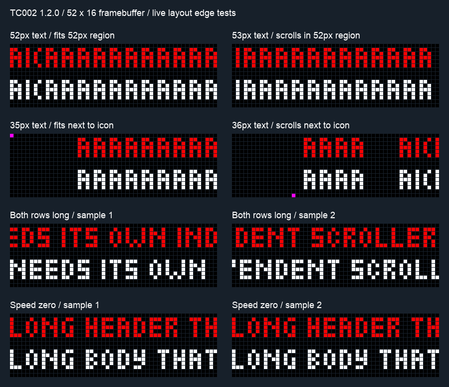
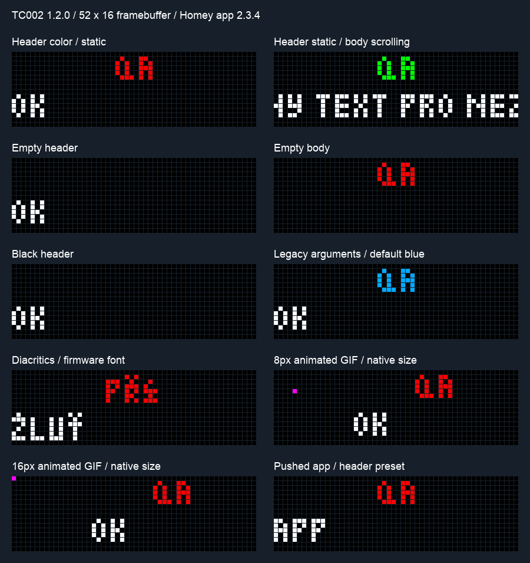

# Živé ověření TC002 a Homey — 6. října 2026

Testováno na TC002 **172.16.10.222**, firmware **1.2.0**, panel **52 × 16**, s nainstalovanou soukromou Homey aplikací **2.3.4**. Akce běžely přes skutečné Homey Flow karty, nastavení přes Homey API. Stav a obraz potvrzovalo HTTP API hodin; náhled ve webovém UI byl také vizuálně zkontrolován. Druhé NG zařízení ani AWTRIX 3 se při živých testech neměnily.

Dočasné skripty, GIFy, aplikace, notifikace, čtyři pozorovací Flow a osm Logic proměnných obsahovaly pouze syntetická QA data. Pozorovací Flow zapisovaly pouze své nově vytvořené Logic proměnné. Zvuk a rádio se testovaly s celkovou hlasitostí 0, následně byla obnovena původní hodnota 90.

## Výsledky

| Oblast | Ověřeno na zařízení / Homey |
|---|---|
| Jas | 0/50/100 % → 0/128/255; odpovídající Homey `dim`; TC002 bez LDR nemění neúčinný flag automatického jasu. Obnoven jas 38. |
| Obraz | Zápis a načtení sytosti, gammy, korekce a tintu; černá `#000000`; vypnutí prázdným polem → `null`; gamma 0 odmítnuta. Obnoveny původní hodnoty. |
| Volby skriptů | Autocomplete skriptu a deklarovaných klíčů; bool/text/number/slider/select/color; čtení výstupních tokenů; zachování `false`, nuly, černé a Unicode. Číslo mimo deklarovanou hranici odmítnuto. |
| Data skriptů | Částečný zápis, zachování nezměněných hodnot, odstranění klíče přes `null`; chybějící klíč hlásí chybu. Deklarovaná volba neprojde zápisem přes data. |
| Sdílené hodnoty | Čtení `0`, `false` a prázdného textu z vlastního headless skriptu. |
| Chyba restartu skriptu | Uložené `fail: true` vyvolalo úmyslnou chybu `setup`. Flow ohlásilo „Saved, but script restart failed…“, přestože zápis proběhl. Změna zpět na `false` obnovila skript. |
| Pojmenovaná notifikace | Zrušení čekající QA notifikace zachovalo jinou aktivní QA notifikaci. Druhé zrušení hlásilo `not found`; nativní endpoint vrací 404. Homey výsledek Flow serializuje chybu jako zprávu. |
| Nadpis a text | Statický krátký nadpis i tělo; barva nadpisu; bílý text; krátký pevný nadpis vedle nezávisle rolujícího dlouhého těla. Prázdný nadpis/tělo/oba řádky; černý nadpis. |
| Kompatibilní argumenty | Volání bez `color` a `options` zachovalo modrou `#00AAFF`. Automatizované živé QA použilo přímé volání karty s původní sadou argumentů. |
| JSON options | Kreslicí pole, chybný tvar JSON a životnost aplikace v notifikační kartě odmítnuty. Současné Add duration a JSON `durationMs` odmítnuty. |
| Ikony/GIF | Dva vlastní dvousnímkové GIFy prošly autocomplete i zobrazením. 8 × 8 se vystředilo v 16 × 16 regionu: značky `(4,4)` a `(11,11)`. 16 × 16: `(0,0)` a `(15,15)`. Bez škálování a bez přesahu do textových regionů. |
| Aplikace s nadpisem | Vytvoření přes Homey kartu, zobrazení přes přepnutí aplikace, správné řádky/barvy; `lifetimeMs: 3000`, `lifetimeExpiry: "remove"` aplikaci odstranilo. Po úklidu obnoveno pořadí. |
| Doba notifikace | Homey Add duration 1500 ms zobrazilo obsah a poté notifikace zanikla. Po vypršení její pojmenovaný DELETE vracel 404. |
| Stav aplikace | První snapshot bez události; změna `Time` → `homey-wind` předala oba názvy. Stejný stav další událost nevytvořil. Notifikace změnu aplikace nespustila. |
| Stav audia | Delší syntetická skladba: `alert` start a stop, poslední název `song` zachován. Trvající nezměněné přehrávání bez další události. Homey boolean vložený do textu zobrazil jako `✓` / `⨯`; stav byl ověřen také jako boolean v API. |
| Stav rádia | Dokumentovaný veřejný SWR3 stream: start a stop se správnou stanicí. Při startu nastaly dvě změny snapshotu, což odpovídá samostatné změně stanice a stavu přehrávání. |
| Chyba audia | Vlastní neexistující URL vyvolalo `alert / HTTP 404`. Jedna error událost; trvající chyba se neopakovala. Úspěšná skladba chybu vyčistila. |
| Fyzická tlačítka a knob | Majitel potvrdil, že jsme je již fyzicky testovali a fungovaly. Toto ověření nebylo součástí automatizovaného běhu 6. října. |

Skriptové čtecí karty byly ověřeny přes skutečné `returnTokens` Homey API. Kompletní uživatelský Advanced Flow se zapojenými výstupními tagy nebyl vytvářen; skutečný uložený a spuštěný klasický Flow byl ověřen u všech čtyř stavových spouštěčů.

**Doplnění majitele, 6. října 2026:** existující Flow fungují se starým i novým AWTRIX zařízením vedle sebe; obě mají shodné zobrazení bez potíží. Kompatibilitu jeho používaných Flow tedy potvrzuje také vlastní provozní test. Původní označení zbývající kontroly jako „migrace Flow“ bylo nepřesné: žádný převod Flow se nezavádí a tento bod se ze seznamu zbývajících kontrol vyřazuje. Konkrétní karty a scénáře majitel ve zprávě nerozepisoval.

Majitel také potvrdil již provedené fyzické testy tlačítek a knobu s funkčním výsledkem. Obecná kontrola těchto ovladačů je tím hotová; jednotlivé typy gest ve zprávě nerozepisoval.

## Oprava zjištěná při testu

Firmware 1.2.0 omezuje textovou volbu skriptu pomocí **bajtů UTF-8**, ne počtu znaků. `Žluť🐱` má pět Unicode znaků, ale deset bajtů a při `maxlen: 8` firmware zápis odmítl. `Ž🐱` má šest bajtů a prošlo. Veřejná dokumentace jednotku `maxlen` výslovně neurčuje; jde o pozorovaný kontrakt tohoto firmwaru.

Lokální commit **`e09f34d`** opravuje předběžnou kontrolu a přidává regresní test, že příliš dlouhý Unicode text nezpůsobí žádný PATCH. Nic se nezkracuje. Původní živý běh výše proběhl před instalací opravy. V navazujícím testu téhož dne byla oprava potvrzena také v běžící Homey **2.3.4**: skutečná karta přijala osmibajtové `ABCDEFGH`, `ŽŽŽŽ` a `🐱🐱`, kratší `Ž🐱` i prázdný text. Devíti-/desetibajtové varianty odmítla zprávou aplikace `Text exceeds the declared maximum length in UTF-8 bytes.` a předchozí hodnota `SAVED` zůstala nezměněná. Vlastní headless QA skript byl následně odstraněn.

Po opravě prošlo **532/532 automatických testů**, TypeScript, ESLint a Homey validace na úrovni `publish`. Validace aplikaci nepublikuje. Při stavění dočasného QA nástroje byly opraveny jeho chyby v tokenových identifikátorech, zápisu výpočtu Logic, názvu mixeru, očekávání textového booleanu a vystředění ikon; nejsou to chyby aplikace.

## Navazující test bodů 1 a 3

Majitel potvrdil instalaci aplikace a zadal autonomní ověření opravy UTF-8 a okrajových případů layoutů. Restartové/výpadkové scénáře a UI/překlady (body 2 a 4) si převzal sám. Nový běh na stejném TC002 1.2.0 a Homey 2.3.4 prošel bez nalezené nové chyby aplikace.

UTF-8 oprava je potvrzená v běžící aplikaci výše. Layouty byly zkoušeny s vlastní pojmenovanou notifikací, syntetickým GIF a dočasným globálním `whenFits: scroll`, aby se ověřilo, že preset své krátké řádky přesto nechá stát. Parametry nastavení se po testech obnovily a byly načteny zpět.

| Layoutový případ | Živý výsledek |
|---|---|
| Přesná hranice 52 px | Viditelná šířka 52 px byla v obou řádcích statická; 53 px již rolovalo. |
| Přesná hranice 35 px vedle ikony | Viditelná šířka 35 px byla statická; 36 px již rolovalo. Textové pixely zůstaly od sloupce 17 a ve správném horním/dolním regionu. Animace ikony se při kontrole pohybu textu vyloučila. |
| Oba dlouhé řádky | Pohyb nadpisu i těla potvrzen několika snímky; bez přesahu mezi regiony. |
| Nulová rychlost | Oba dlouhé řádky stály. Samostatný test bez `hold` s implicitním `repeat: 1` zůstal beze změny i po 3,6 s při globální době 1,2 s: průjezd při rychlosti 0 není dokončen. Notifikace byla poté zrušena vlastním názvem. |
| Rychlost 0, `repeat: 0`, `durationMs: 1200` | Notifikace skončila přibližně za 1272 ms. |
| `durationMs: 0` / `-1`, `repeat: 0` | Použila se dočasná globální doba 1800 ms; zánik za 1847 / 1835 ms. |
| Krátký statický text bez explicitní doby | Výchozí `repeat: 1` nepřidržovalo stojící řádky; zánik za 1809 ms dle globální doby. |
| `repeat: 0`, `durationMs: 900`, velmi dlouhý text | Zánik za 959 ms; počet průjezdů se nevyžadoval. |
| `repeat: 1` / `2`, stejný dlouhý text | Zánik za 1077 / 2241 ms, přibližně dvojnásobný čas. |
| `repeat: 1`, `durationMs: 3500` | Zánik za 3549 ms: explicitní doba fungovala jako minimum i po dokončení textu. |
| `repeat: 2`, `durationMs: 600` | Zánik za 2185 ms: dvě opakování prodloužila zobrazení nad krátkou minimální dobu. |
| Oba řádky s `repeat: 1`, nadpis delší než tělo | Zánik za 1794 ms; stránka čekala na delší nadpis. |
| `hold: true`, `durationMs: 600`, `repeat: 0` | Notifikace byla stále viditelná po 2300 ms a zanikla až po vlastním pojmenovaném DELETE. |

Časy jsou odečty živého framebufferu po dokončení Homey akce, s kontrolou přibližně každých 100 ms. Nejde o přesnost interního časovače na milisekundu. Test dočasně používal scroll 600 % pro časovací případy; původních 100 % bylo obnoveno.

Časování bylo navíc ověřeno samostatně přes **aplikační kartu**. Vlastní QA aplikace se dočasně střídala s `Time`; po testu byly obnoveny a porovnány původní pořadí i enabled/disabled stavy aplikací. Nastavený přechod `Rain` trvá 1000 ms a dokumentované `currentApp` drží odcházející název až do jeho dokončení. Tabulka proto uvádí jak celkový odečet odchodu, tak dobu obsahu po odečtení této animace; nejde o jiný kontrakt časování ani o chybu aplikace.

| Aplikační karta | Doba obsahu / odchod `currentApp` |
|---|---|
| `durationMs: 1000`, `repeat: 0`, krátký text | 1064 / 2064 ms |
| `durationMs: 0`, `repeat: 0`, globální doba 1200 ms | 1126 / 2126 ms |
| `repeat: 1` / `2`, stejný dlouhý text | 1126 / 2144 ms obsahu; odchod 2126 / 3144 ms |
| `durationMs: 3500`, `repeat: 1` | 3528 / 4528 ms |
| `durationMs: 600`, `repeat: 2` | 2193 / 3193 ms |
| Rychlost 0, implicitní `repeat: 1`, globální doba 1200 ms | QA aplikace zůstala aktivní i po 3156 ms, potom byla odstraněna při úklidu. |

U opakování se v přesném živém odečtu zaznamenalo 1126 ms pro jeden průjezd a **2144 ms** pro dva. Odečtení přechodu je odhad času obsahu se stejnou tolerancí jako ostatní živé testy.

Šířka se kalibrovala skutečným fontem `small`: posun `A` = 4 px, `I` = 2 px, `(` = 3 px a vnitřní mezery = 2 px. U vzorku končícího `A` je viditelná šířka o pixel menší než součet posunů znaků. Počáteční mezera neposunula vykreslený vzorek, proto nebyla použita jako kalibrační znak; tento jev nebyl připsán aplikaci ani dále diagnostikován. Původní kalibrační chyby a započítání pohybu GIFu byly chyby QA nástroje, následně opravené.

## Pixelový náhled

Obrázek níže je vykreslený z živých odpovědí `/api/v1/display/screen`, každý čtverec představuje jeden pixel. Zachovává původní 52 × 16 rastr. U GIF je zachycen jeden snímek; oba animační snímky byly kontrolovány samostatně. Unicode řetězce firmware přijal a vykreslil vlastním fontem; náhled nelze považovat za záruku podpory všech českých znaků či emoji.

Framebuffer nezobrazuje výslednou fyzickou intenzitu, gamma/korekci LED ani kvalitu zvuku. Není fotografií displeje.

## Co ještě není živě ověřeno

- Migrace capabilities po instalaci nové verze; uživatelské UI výběru barvy a jazyků.
- Reset výchozího snapshotu po výpadku, restartu aplikace/hodin a změně připojení; zánik rychlých GET po odstranění Flow měřený síťovým provozem; více zařízení bez přesahu.
- Prázdná rotace, audio skupina `app`, změna rádio stanice a hudebních metadat; opakované vyvolání stejné chyby po jejím vyčištění.
- Živý RAW na 32 × 8, starší NG firmware, AWTRIX 3 a automatický jas zařízení s LDR. Automatická regresní sada tyto podporované cesty nadále pokrývá.
- Vizuální účinek nastavení LED a slyšitelná kvalita zvuku vyžadují člověka u hodin. Tlačítka a knob jsou již fyzicky ověřené dle potvrzení majitele.

Tyto body představují zbývající ověření, nikoli známé nové závady. Ciferníky zůstávají samostatně odloženou funkcí; moodlight se dle rozhodnutí majitele nepřidává.

## Závěrečný stav

Zkontrolována obnova jasu, sytosti, gammy, korekce, tintu a rotace; celková hlasitost 90, všechny audio skupiny zastavené, úmyslné audio chyby vyčištěné. Vlastní QA skript/aplikace/ikony/notifikace/Flow/Logic proměnné byly odstraněny. Po navazujících testech bodů 1 a 3 byl navíc obnoven a načten zpět globální scroll, doba aplikace 7000 ms, rotace a původní pořadí i enabled/disabled stavy aplikací; nové QA objekty byly odstraněny. TC002 je nadále dostupný v Homey. Veřejná větev ani Store nebyly měněny.

Primární podklady: [TC002 HTTP API](https://ang.blueforcer.de/tc002/reference/http/), [payload a časování](https://ang.blueforcer.de/tc002/reference/payload/), [layouty](https://ang.blueforcer.de/tc002/guides/layouts/), [skriptování](https://ang.blueforcer.de/tc002/guides/scripting/), [uložená data](https://ang.blueforcer.de/tc002/guides/storage/), [Homey Flow arguments](https://apps.developer.homey.app/the-basics/flow/arguments). Dokumentace a výše popsané živé pozorování jsou oddělené zdroje pravdy.
